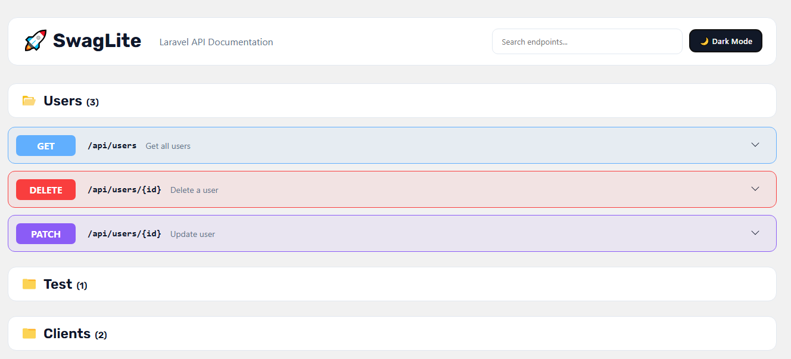
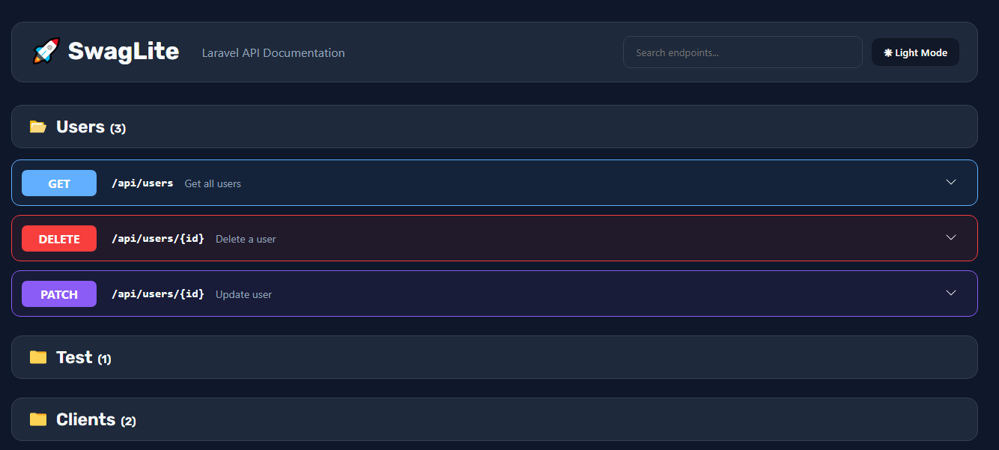

# SwagLite

Lightweight API documentation for Laravel.

## Features

- Interactive API documentation
- Execute API requests directly from the browser
- Path parameters (`/users/{id}`)
- JSON request bodies
- GET, POST, PUT, PATCH and DELETE support
- Search endpoints instantly
- Dark mode support 🌙
- Attribute-based documentation
- Lightweight and zero external dependencies
- Built-in Bearer Token authentication
- Copy endpoint URLs and cURL commands with one click

## Installation

```bash
composer require guljahang/swaglite
```

Publish the package assets:

```bash
php artisan vendor:publish --tag=swaglite-assets
```
## Access the Documentation

### After installing the package, start your Laravel application and open:

```bash
http://localhost:8000/swaglite
```

## Usage

### Response Documentation

```php
#[SwagResponse(
    status: 200,
    description: 'Success'
)]
public function index()
{
    return User::all();
}
```

### Path Parameters

```php
#[SwagParameter(
    name: 'id',
    in: 'path',
    required: true,
    example: 1
)]
public function show($id)
{
    return User::findOrFail($id);
}
```

### Request Body

```php
#[SwagParameter(
    name: 'name',
    in: 'body',
    required: true
)]
#[SwagParameter(
    name: 'email',
    in: 'body',
    required: true
)]
public function store(Request $request)
{
    return $request->all();
}
```

## Supported Methods

- GET
- POST
- PUT
- PATCH
- DELETE

## Screenshots
### Light Mode

### Dark Mode


## License

MIT